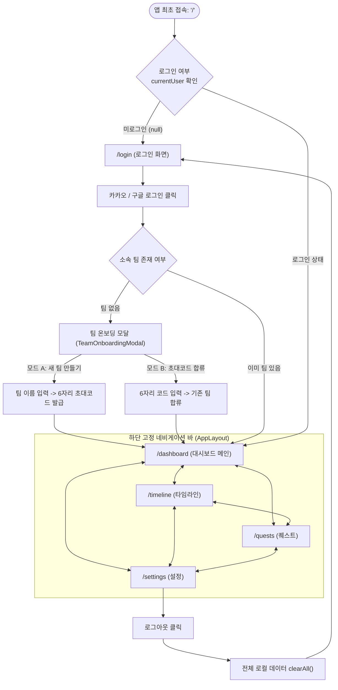
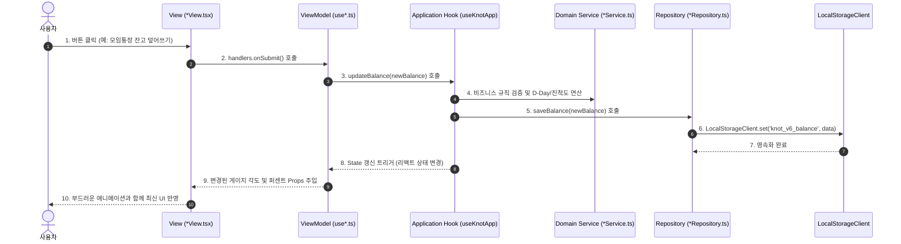

# KNOT (낫) 프론트엔드 화면 흐름 및 아키텍처 가이드

본 문서는 **KNOT (공동 목표 빌드 플랫폼)** 프론트엔드의 화면 진입/전환 흐름(Navigation Flow), MVVM 기반 계층형 아키텍처(Layered Role Architecture), 데이터와 상태의 단방향 흐름(Data Flow)을 상세히 설명합니다.

---

## 1. 프론트엔드 화면 전환 흐름 (Screen Flow)

KNOT은 모바일 친화적인 반응형 웹 애플리케이션으로, 인증 가드(Auth Guard)와 온보딩 프로세스를 거쳐 메인 서비스 화면으로 진입합니다.



---

## 2. 각 화면별 핵심 기능 및 UI 흐름

### 2.1 루트 진입로 (`/`)
- **역할**: 인증 가드(Auth Guard) 라우터.
- **흐름**: 
  - `currentUser`가 없으면 `router.replace('/login')`을 통해 로그인 화면으로 자동 이동.
  - 로그인되어 있으면 즉시 `DashboardPageView`를 렌더링.

### 2.2 로그인 화면 (`/login`)
- **역할**: KNOT의 원팀 철학 소개 및 소셜 계정 로그인 진입점.
- **주요 UI**:
  - 브랜드 심볼 및 가치 제안 (비교 없는 원팀 게이지바, 일정/지출 타임라인, DATT 연동).
  - 카카오 / 구글 소셜 로그인 버튼 (`SocialLoginButtons`).
  - 팀 온보딩 모달 (`TeamOnboardingModal`): 소셜 로그인 완료 후 아직 팀이 없다면 팝업되어 새 팀 생성 또는 초대 코드 입력을 유도.

### 2.3 대시보드 화면 (`/dashboard`)
- **역할**: 팀의 목표 달성 현황을 한눈에 확인하는 원팀 홈.
- **주요 UI 컴포넌트**:
  - **원팀 게이지 (`OneTeamGauge`)**: 개별 기여도를 숨기고 팀 전체의 목표액 대비 현재 잔고(%)를 원형 SVG 게이지로 시각화.
  - **모임통장 잔고 덮어쓰기 모달 (`BalanceUpdateModal`)**: 카카오 모임통장 등의 현재 총 잔액을 입력하거나 빠른 추가 칩(+10만, +50만 등)을 통해 즉시 게이지 동기화.
  - **공동 목표 카드 (`GoalSummaryCard`)**: 목표명, 목표 금액, 목표 기한 표시 및 수정 기능.
  - **DATT 시너지 배너 (`DattSynergyBanner`)**: DATT 유니버스와 연동된 핫플/공간 추천 바로가기 링크.
  - **최근 기록 위젯 (`RecentTimelineWidget`)**: 최근 등록된 타임라인 일정/지출 3건 미리보기.
  - **할 일 체크리스트 위젯 (`UpcomingQuestsWidget`)**: 팀원들이 완료해야 할 미완료 과제 3건 표시 및 즉시 체크 완료 기능.

### 2.4 타임라인 화면 (`/timeline`)
- **역할**: 팀의 여정(마일스톤, 모임/일정, 지출 내역)을 시간축으로 기록하는 세로형 로드맵.
- **주요 UI 컴포넌트**:
  - **상단 필터 (`TimelineFilter`)**: 전체 / 마일스톤 / 모임&일정 / 지출 기록 필터링.
  - **타임라인 노드 리스트 (`TimelineNodeItem`)**: 날짜 순 세로 점선 로드맵, 노드 클릭 시 완료/취소 토글, 삭제 지원.
  - **타임라인 노드 추가 모달 (`AddTimelineNodeModal`)**: 마일스톤/일정/지출 추가 폼. 모임 일정의 경우 "DATT 추천 공유 장소" 동의 체크박스 제공.

### 2.5 퀘스트 화면 (`/quests`)
- **역할**: 큰 단위의 마일스톤 과제(퀘스트)와 세부 체크리스트(태스크) 관리.
- **주요 UI 컴포넌트**:
  - **퀘스트 카드 (`QuestCard`)**: 카테고리(프로젝트, 여행, 주거, 스터디, 웨딩, 재정 등)별 뱃지와 진행률 프로그레스 바.
  - **체크리스트 아이템 (`TaskItem`)**: 세부 할 일 체크박스 및 담당자 뱃지(나, 팀원, 공동).
  - **할 일 추가 모달 (`AddTaskModal`)**: 특정 퀘스트 하위에 체크리스트 아이템 추가 및 담당자 지정.
  - **새 퀘스트 생성 모달 (`AddQuestModal`)**: 새로운 마일스톤 과제 생성.

### 2.6 설정 화면 (`/settings`)
- **역할**: 팀 관리, 팀원 초대, 계정 관리 및 데이터 리셋.
- **주요 UI 컴포넌트**:
  - **내 로그인 계정 카드**: 현재 로그인된 닉네임, 이메일, 프로필 아바타.
  - **팀 정보 & 초대 코드 카드**: 팀명, 6자리 고유 초대 코드, 원클릭 클립보드 복사 버튼.
  - **팀원 목록**: 팀 내 참여자 아바타 및 역할(팀장/팀원).
  - **로그아웃 버튼**: 세션 종료 및 브라우저 로컬 데이터 일괄 초기화.

---

## 3. 계층형 아키텍처 (Layered Clean Architecture)

KNOT 프론트엔드는 책임과 관심사에 따라 **3개의 메인 계층(Layer)**으로 엄격하게 분리되어 있습니다.

| 계층 (Layer) | 주요 디렉터리 | 핵심 책임 및 역할 | 의존 방향 및 상호작용 |
| :--- | :--- | :--- | :--- |
| **1. 프레젠테이션 계층<br/>(Presentation Layer)** | `presentation/`<br/>• `pages/`<br/>• `views/`<br/>• `view-models/`<br/>• `components/`<br/>• `layouts/` | • 사용자 화면(HTML/JSX) 렌더링<br/>• 사용자 인터랙션(클릭, 입력) 수신<br/>• 컴포넌트 단위 상태(UI State) 관리 및 폼 제어 | **하위 계층 참조**: `Application Layer`의 도메인 훅(`useKnot`)을 호출하여 비즈니스 데이터 및 액션 구독 |
| **2. 애플리케이션 계층<br/>(Application Layer)** | `application/`<br/>• `services/`<br/>• `hooks/` | • 프레임워크와 독립적인 순수 비즈니스 규칙(연산, 유효성 검증)<br/>• 도메인 상태 관리 및 전역 상태 오케스트레이션 | **상/하위 중계**: `Presentation`의 요청을 받아 비즈니스 서비스로 처리한 뒤, `Infrastructure` 저장소에 영속화 위임 |
| **3. 인프라 계층<br/>(Infrastructure Layer)** | `infrastructure/`<br/>• `storage/`<br/>• `http/` | • 브라우저 로컬 저장소(`LocalStorageClient`) I/O 처리<br/>• 백엔드 REST API 통신(`httpClient`)<br/>• 캐시 정화 및 SSR 안정성 보장 | **최하위 계층**: 비즈니스 로직에 관여하지 않고 순수 데이터 I/O 인터페이스만 구현하여 제공 |

### 3.1 계층별 상세 설명

#### 1) 프레젠테이션 계층 (Presentation Layer)
- **위치**: `presentation/`
- **책임**: 사용자와 직접 마주하는 화면 렌더링 및 UI 이벤트 수집.
- **특징**:
  - 화면 마크업을 담당하는 **순수 뷰(`views/`)**와 UI 로직을 담당하는 **뷰모델(`view-models/`)**로 역할을 명확히 분리(MVVM).
  - 비즈니스 연산(D-Day, 초대코드 생성, 달성률 계산 등)을 직접 수행하지 않고 애플리케이션 계층에서 가공된 파생 상태를 주입받아 표기만 담당합니다.

#### 2) 애플리케이션 계층 (Application Layer)
- **위치**: `application/`
- **책임**: KNOT 서비스의 핵심 유스케이스(Use Cases)와 비즈니스 규칙 오케스트레이션.
- **구성 요소**:
  - **도메인 서비스 (`services/`)**: React 의존성이 전혀 없는 순수한 TypeScript 함수 집합 (`goalService`, `teamService`, `timelineService`, `questService`). 테스트가 매우 용이하며 UI 프레임워크가 바뀌어도 재사용 가능.
  - **애플리케이션 훅 (`hooks/`)**: React 생태계와 도메인 서비스를 연결해주는 상태 관리 훅 (`useTeam`, `useGoal`, `useTimeline`, `useQuests`, `useKnotApp`).

#### 3) 인프라 계층 (Infrastructure Layer)
- **위치**: `infrastructure/`
- **책임**: 외부 시스템(브라우저 스토리지, HTTP API 등)과의 실제 데이터 입출력.
- **구성 요소**:
  - **`LocalStorageClient`**: `window` 객체 유무 검사를 통한 Next.js SSR 방어, `knot_v6_` 네임스페이스 격리, 이전 구버전 테스트 데이터 자동 정화.
  - **리포지토리 (`storage/*Repository.ts`)**: 도메인 엔티티(Team, Goal, TimelineEvent, Quest)를 로컬 스토리지에 직렬화/역직렬화하여 저장하고 불러오는 책임.
  - **HTTP 클라이언트 (`http/httpClient.ts`)**: 향후 Spring Boot 백엔드 서버와의 통신을 전담할 확장 대비 모듈.

---

## 4. 프레젠테이션 계층의 역할별 디렉터리 분리 (Role-Based Structure)

컴포넌트 폴더 내부에 로직과 UI 마크업이 뒤섞이지 않도록, **순수 뷰(`*View.tsx`)**와 **순수 뷰모델(`use*.ts`)**을 최상위 디렉터리로 물리적 격리했습니다.

```
presentation/
├── components/                   # [조립용 단일 진입점 어댑터]
│   ├── auth/                     # SocialLoginButtons, TeamOnboardingModal
│   ├── common/                   # Button, Card, Input, Modal, Badge, Tabs, KnotIcon
│   ├── dashboard/                # OneTeamGauge, GoalSummaryCard, BalanceUpdateModal ... (7개)
│   ├── quests/                   # QuestCard, AddQuestModal, TaskItem ... (5개)
│   └── timeline/                 # AddTimelineNodeModal, TimelineNodeItem ... (4개)
│
├── layouts/                      # AppLayout.tsx (어댑터)
├── pages/                        # PageView 어댑터 (Dashboard, Timeline, Quests, Settings, Login)
├── state/                        # KnotContext.tsx (Application Hook을 자식에 전달하는 경량 컨텍스트)
├── types/                        # TypeScript 인터페이스 정의
│
├── view-models/                  # [100% 함수 / 상태 / 연산 로직 (.ts)]
│   ├── auth/                     # useTeamOnboardingModal.ts
│   ├── dashboard/                # useOneTeamGauge.ts, useGoalSummaryCard.ts ...
│   ├── layouts/                  # useAppLayout.ts
│   ├── pages/                    # useDashboardViewModel.ts, useQuestsViewModel.ts ...
│   ├── quests/                   # useQuestCard.ts, useTaskItem.ts ...
│   └── timeline/                 # useAddTimelineNodeModal.ts, useTimelineNodeItem.ts
│
└── views/                        # [100% 순수 Presentational JSX 마크업 (.tsx)]
    ├── auth/                     # TeamOnboardingModalView.tsx
    ├── dashboard/                # OneTeamGaugeView.tsx, GoalSummaryCardView.tsx ...
    ├── layouts/                  # AppLayoutView.tsx
    ├── pages/                    # DashboardView.tsx, TimelineView.tsx, LoginView.tsx ...
    ├── quests/                   # QuestCardView.tsx, TaskItemView.tsx ...
    └── timeline/                 # AddTimelineNodeModalView.tsx, TimelineNodeItemView.tsx
```

### 컴포넌트 3단 분리 패턴 예시: `OneTeamGauge`
1. **`useOneTeamGauge.ts` (View-Model)**: SVG 기하학(반지름, 둘레, `strokeDashoffset`), 퍼센트 달성률, 한글 금액 포맷팅 연산 수행. JSX 0줄.
2. **`OneTeamGaugeView.tsx` (View)**: 상태(`state`)와 핸들러(`handlers`)를 Props로 받아 오직 화면을 렌더링. 내부 함수 및 훅 선언 0개.
3. **`OneTeamGauge.tsx` (Adapter)**: 외부에서 호출하기 쉬운 3줄짜리 어댑터.
   ```tsx
   export const OneTeamGauge: React.FC<OneTeamGaugeProps> = (props) => {
     const viewModel = useOneTeamGauge(props);
     return <OneTeamGaugeView {...viewModel} />;
   };
   ```

---

## 5. 단방향 데이터 흐름 (Unidirectional Data Flow)

사용자가 화면에서 버튼을 클릭했을 때 데이터가 흘러가는 과정:



---

## 6. 브라우저 스토리지 및 세션 관리 원칙

- **SSR 안전성**: Next.js 서버 사이드 렌더링 시 `window` 객체 부재로 인한 Hydration 에러를 방지하도록 `LocalStorageClient` 내부에서 방어 처리.
- **네임스페이스 격리 (`knot_v6_`)**: 버전 접두사를 부여하여, 개발 버전 업데이트 시 이전 구버전 테스트 캐시(`knot_v5_` 등)를 자동 스캔하여 일괄 삭제.
- **로그아웃 시 완전 정화**: 설정 페이지에서 로그아웃 시 `LocalStorageClient.clearAll()`을 실행하여 브라우저에 잔여 개인정보 및 팀 데이터가 남지 않도록 보장.
